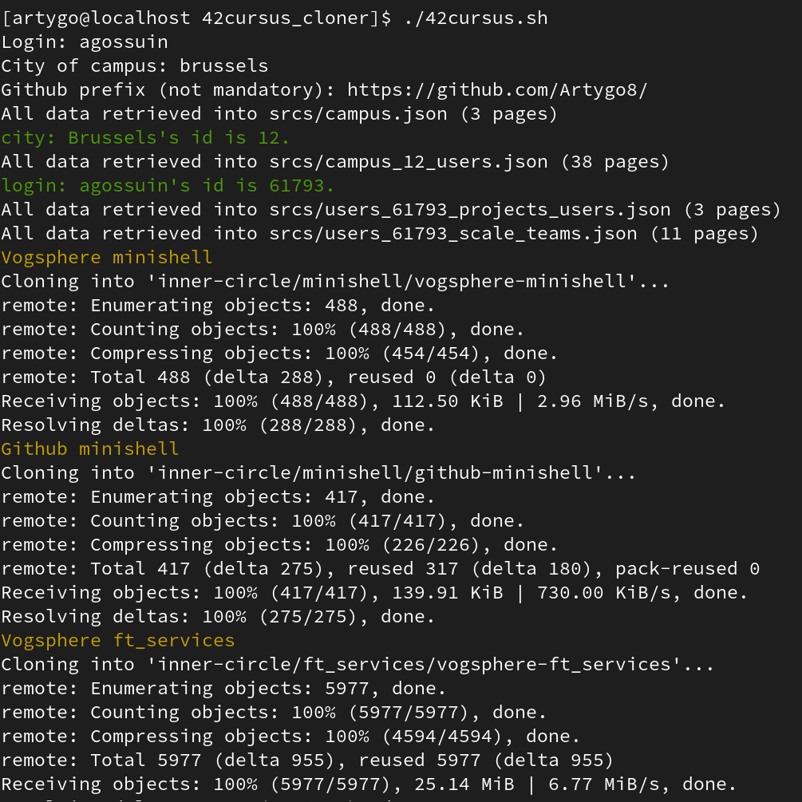

# 42cursus_cloner
Clone your entire 42cursus into directories.

## Utility
Tool to clone your entire cursus from the intra and organize it into files.
You can also clone your 42 projects from a github repository.

## dependencies
- jq

## Screenshots

